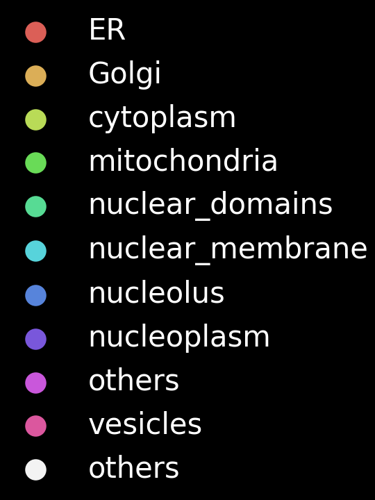

# napari 3D UMAP rotation example
Example of how to generate a rotating 3D UMAP in [napari](http://www.napari.org).
This examples uses data from the [cytoself](https://www.nature.com/articles/s41592-022-01541-z)
project applied to [OpenCell](https://opencell.czbiohub.org/) data. The code is quite specific
to our data and purpose but gives you a good starting point for your own experimentation...


## Installation

```bash
conda create -n napari3drot python=3.9
conda activate napari3drot
pip install -r requirements.txt
```

If you are on a M1 Mac, you should try instead the `setup_env.sh` script.


## Sample code for generating a rotating 3D UMAP:

In the following we assume you have already the 3D point coordinates
saved as a numpy array (npy). You can use the [UMAP](https://umap-learn.readthedocs.io/en/latest/) package
to go from your high-imensional data to 3D UMAP-projected coordinates.


```python
from os.path import join
import napari
import numpy as np
import seaborn as sns
from napari_animation import Animation

# Load data:
data_name = 'cuml_umap3D_vqindhist2_nb1000_md0'
# UMAP 3D coordinates:
umap3d_data = np.load(join('data', data_name + '.npy'))
# Annotation data for colors:
umap_lab = np.load(join('data', 'test_label_nucenter_uniorg_corum.npy'), allow_pickle=True)

# Make a color matrix for the annotations:
# (Quite specific to our data and problem)
uniq_uniorg = np.unique(umap_lab[:, 0])
lab_color = np.zeros((len(umap_lab), 4))
cmap = sns.color_palette("hls", len(uniq_uniorg))
for i, fmly in enumerate(uniq_uniorg):
    if fmly == 'others':
        c = np.array(sns.color_palette('Greys', 100)[9] + (0.25,)).reshape(1, -1)
    else:
        c = np.array(cmap[i] + (1,)).reshape(1, -1)
    ind = umap_lab[:, 0] == fmly
    lab_color[ind] = c

# instantiates a viewer with a points layer: 
viewer = napari.view_points(
    umap3d_data, 
    scale=(100,) * 3, 
    shading='spherical', 
    size=0.06, 
    name='umap3d_nb1000', 
    edge_width=0,
    face_color=lab_color, 
    ndisplay=3,
)

# Resizes window and tries to get a square canvas:
viewer.window.resize(1000+300, 1000)

# Set parameters for the video
scale_factor = 0.5  # scale factor for the final output video size
nb_steps = 30  # number of steps between two target angles

# Instantiates a napari animation object for our viewer:
animation = Animation(viewer)

# Ensures we are in 3D view mode:
viewer.dims.ndisplay = 3

# resets the camera view:
viewer.reset_view()

# Start recording key frames after changing viewer state:
viewer.camera.angles = (0.0, 0.0, 90.0)
animation.capture_keyframe()
viewer.camera.angles = (0.0, 180.0, 90.0)
animation.capture_keyframe(steps=nb_steps)
viewer.camera.angles = (0.0, 360.0, 90.0)
animation.capture_keyframe(steps=nb_steps)

# Render animation as a GIF:
animation.animate(f'demo.gif', canvas_only=True, fps=20, scale_factor=scale_factor)

```


Supported output formats are: 
`.gif`, `.mp4`, `.mov`, `.avi`, `.mpg`, `.mpeg`, `.mkv`, `.wmv`
If no extension is provided, images are saved as a folder of PNGs.

## Generating more complex videos
See the videos in [this](https://twitter.com/loicaroyer/status/1551583552042455040?s=20&t=BBsuuAr8VVToiWaAs-ooaQ) 
and [this](https://twitter.com/loicaroyer/status/1551583560649256960?s=20&t=BBsuuAr8VVToiWaAs-ooaQ) tweets for an examles of a videos that were made from clips generated with napari.
We used the presentation tool KeyNote to compose these more complex videos with added text, effects,
and overlays -- but any other video editing tool could be similarly used.

## Legend

You might need to generate the legend if you want to compose more complex videos
using video editing tools. Here is an example on how to do that:

```python
import matplotlib.pyplot as plt

plt.style.use('dark_background')
fig, ax = plt.subplots(1)
legendFig = plt.figure(figsize=(1.6, 2.4))
plist = []
for i, c in enumerate(cmap):
    plist.append(
        ax.scatter(i, i, c=np.array(cmap[i] + (1,)).reshape(1, -1), s=40, label=uniq_uniorg[i])
    )
plist.append(
    ax.scatter(
        i + 1, i + 1, c=np.array(sns.color_palette('Greys', 100)[9] + (1,)).reshape(1, -1), s=40, label='others'
    )
)
legendFig.legend(plist, np.hstack([uniq_uniorg, 'others']), loc='center', frameon=False)
legendFig.savefig('legend_uniorg.png', dpi=300)

```




